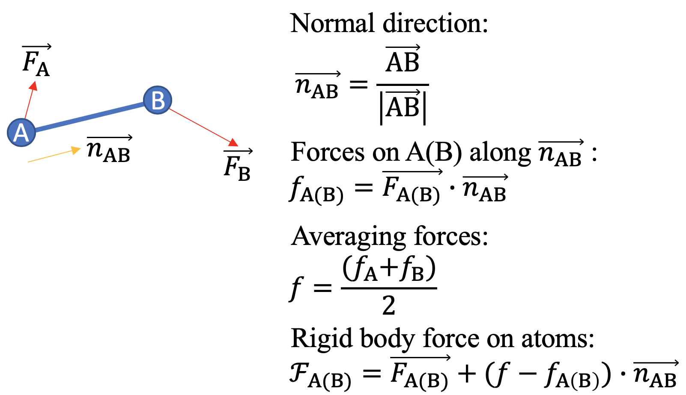

# VASP_BOND_FIX
Fixing bond length for specific atoms during geometry optimization (relaxation) process implemented in VASP package.

## Method

### implementation
```
loop over NSTEP:
  |--> scf force
  |--add-->  constrain force (change force)
  |--> Force convergence?
  |--> IBRION ionic movements
  |--add-->  constrain distance (change position)
end loop
```

Check `stdout` for `CONSTRAIN_FORCE is done.` and `CONSTRAIN_POSITION is done.`
Check `OUCAR` for `CONSTRAINED TOTAL-FORCE` block.

## Install
Put `bond_length.patch` file in the root directory of your VASP distro and type:
```
$ patch -p0 < bond_length.patch
```

## Usage
An additional file called `CONSTRAIN` is needed for specifying which bonds to fix, and its length.
syntax:
```
ATOM1# ATOM2# BOND_LENGTH1
ATOM3# ATOM4# BOND_LENGTH2
...
```
Then a regular relaxation can be performed.

if `Selective-dynamics` on one of the constrained atoms, the bond length constrain will move the other atom,
if no `Selective-dynamics` used on the constrained atoms, the bond length is distributed evenly to each atom according to the bond center (POS_1+POS_2)/2.

## Caveats
1. Initial bond length should equal the one specified in `CONSTRAIN` file.
2. Convergence maybe slow, might want to loosen the convergence criteria
3. Be careful with variable cell calculation, we do not apply constrains on cell stress.

## Notes
*1. No source file is shared.*

*2. The correctness of this patch has been checked with few simple cases.*

*3. Any result obtained by this fix should be carefully checked by yourself.*

*4. This patch only works on currently VASP 5.4.4.*

*5. A major part of this implementation was contributed by someone at GaTech.*
